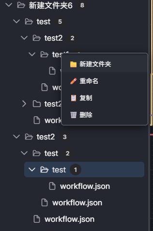
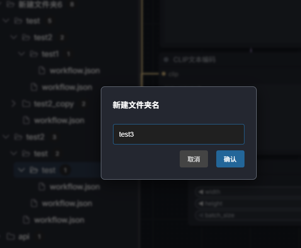
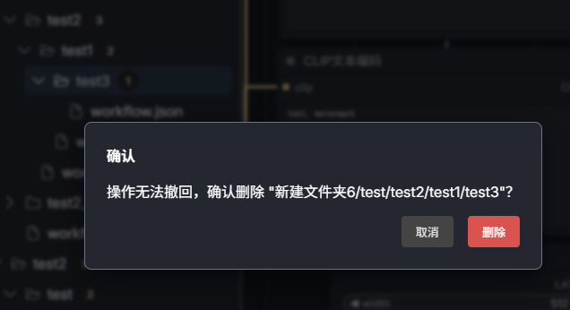
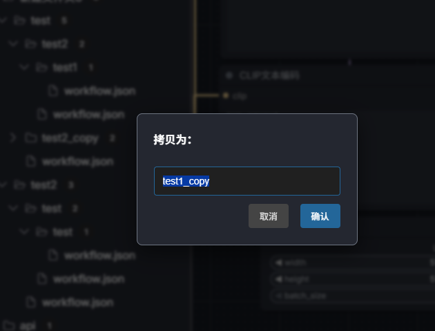
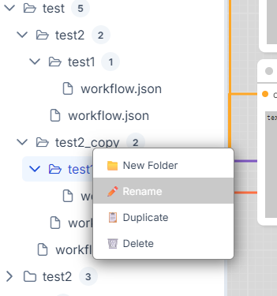
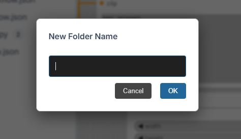
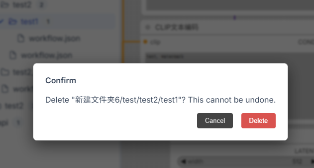
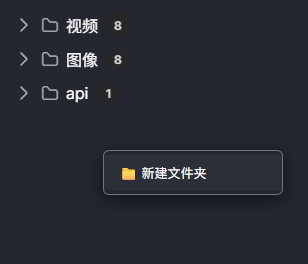

# ComfyUI Workflow Folders

[中文](#chinese) | [English](#english)

<h2 id="chinese">中文</h2>

### ComfyUI Workflow Folders

    ComfyUI Workflow Folders 旨在增强 ComfyUI 原生的工作流面板，提供目录管理功能和右键菜单，在 ComfyUI 中快速完成工作流分类管理。

### ✨核心功能

    📂 在工作流面板空白位置右键菜单中新增目录
    📂 在指定目录上精准执行以下操作来实现灵活的工作流分类整理
        添加文件夹
        删除
        重命名
        拷贝

### ⚠️使用注意

    ⚠️ 重要提示：本项目仅针对目录结构进行操作，未覆盖原生的工作流文件右键菜单

### 安装方式

    cd ComfyUI/custom_nodes
    git clone https://github.com/loFei/ComfyUI-Workflow-Folders.git

<h2 id="english">English</h2>

### ComfyUI Workflow Folders

    ComfyUI Workflow Folders is designed to enhance the native ComfyUI workflow panel by providing directory management and context menus, enabling quick workflow classification within ComfyUI.

### ✨Core Features
    📂 Add a new directory via the context menu when right-clicking on an empty area of the workflow panel.
    📂 Perform the following actions precisely on specified directories to achieve flexible workflow classification and organization:
        Add Folder
        Delete
        Rename
        Copy

### ⚠️Usage Notes
    ⚠️ Important Notice: This project operates solely on the directory structure and does not override the native workflow file context menu.

### Installation

    cd ComfyUI/custom_nodes
    git clone https://github.com/loFei/ComfyUI-Workflow-Folders.git

  

  

  

  

  

  

  

  
